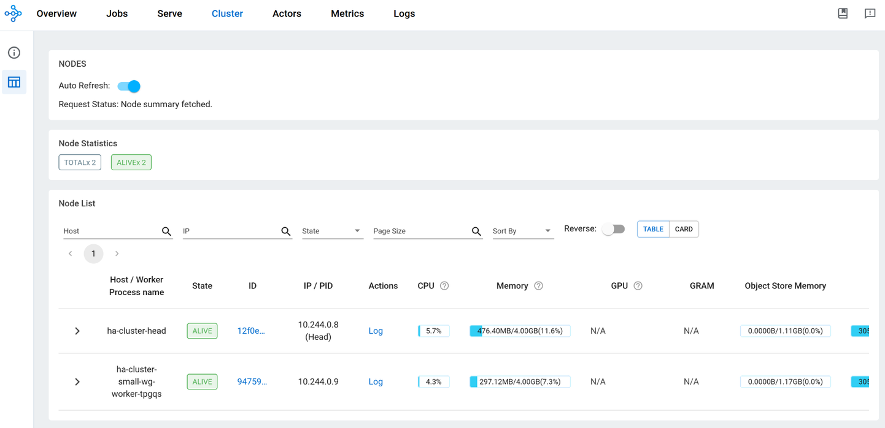
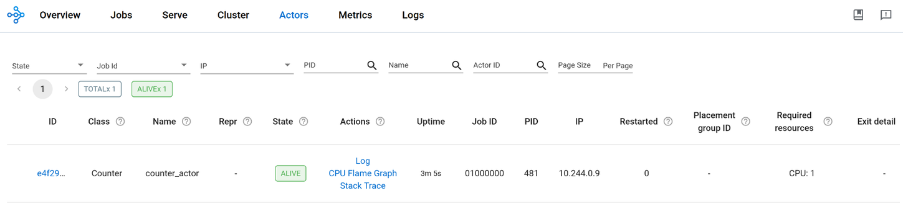

# Creating HA cluster with APIServer

> Note: The KubeRay API server V1 does not support `gcsFaultToleranceOptions` yet.
> Therefore, this example uses the legacy method to create a RayCluster with GCS fault tolerance.

One of the issues with long-running Ray applications (e.g., RayServe) is that if the Ray head node
dies, the whole cluster has to be restarted. Fortunately, the KubeRay cluster solves this by
introducing the [Fault Tolerance Ray Cluster](https://docs.ray.io/en/master/cluster/kubernetes/user-guides/kuberay-gcs-ft.html).

The RayCluster with high availability can also be created with the APIServer, which aims to
ensure high availability of Global Control Service (GCS) data. The GCS manages
cluster-level metadata by storing all data in memory, which lacks fault tolerance. A
single head node failure can cause the entire RayCluster to fail. To enable GCS fault tolerance,
we should have a highly available Redis so that when GCS restarts, it can resume its
state by retrieving previous data from the Redis instance.

We will provide a detailed example on how to create this highly available APIServer.

## Setup

### Setup Ray Operator and APIServer

Refer to the [Install with Helm](README.md#install-with-helm) section in the README for
setting up the KubeRay operator and APIServer, and port-forward the HTTP endpoint to local
port 31888.

## Example

Before going through the example, remove any running RayClusters to ensure a successful
run through of the example below.

```sh
kubectl delete raycluster --all
```

### Create external Redis cluster

Comprehensive documentation on creating a Redis cluster on Kubernetes can be found
[here](https://www.dragonflydb.io/guides/redis-kubernetes). For this example, we will use a simple
[RedisYAML]. Simply download this YAML file and run:

```sh
kubectl apply -f redis.yaml
```

### Create Redis password secret

Before creating your cluster, you need to create a secret in the
namespace where you are planning to create your Ray cluster (remember, that secret is visible only within a given
namespace). To create a secret for using external Redis, please download the [Secret] and
run the following command:

```sh
kubectl apply -f redis_passwrd.yaml
```

### Install ConfigMap

We will use this [ConfigMap], which contains code for our example. For real-world
cases, it is recommended to pack user code in an image.

Please download the config map and deploy it with the following command:

```sh
kubectl apply -f code_configmap.yaml
```

### Create RayCluster

Use the following command to create a compute template and a RayCluster:

```sh
curl -X POST 'localhost:31888/apis/v1/namespaces/default/compute_templates' \
    --header 'Content-Type: application/json' \
    --data @docs/api-example/compute_template.json

curl -X POST 'localhost:31888/apis/v1/namespaces/default/clusters' \
    --header 'Content-Type: application/json' \
    --data @docs/api-example/ha_clusters.json
```

### Validate that RayCluster is deployed correctly

Run the following command to get a list of pods running. You should see one head and one worker node
as shown below:

```sh
kubectl get pods
# NAME                                READY   STATUS    RESTARTS   AGE
# ha-cluster-head                     1/1     Running   0          2m36s
# ha-cluster-small-wg-worker-22lbx    1/1     Running   0          2m36s
```

### Create an Actor

Before we try to trigger the restoration, we need to find a way to validate that our GCS restore
is working correctly. We will validate this by creating a detached actor. If it still
exists and functions after the head node deletion and restoration, we can confirm that the
GCS data is restored correctly.

Run the following command to create a detached actor. Please change `ha-cluster-head` to
your head node's name. Note that the `detached_actor.py` file is defined in the
[ConfigMap] we installed earlier and mounted to the head node:

```sh
kubectl exec -it ha-cluster-head -- python3 /home/ray/samples/detached_actor.py
```

Then, open a new terminal and use port-forward to enable access to the Ray dashboard.
The dashboard can be accessed through `http://localhost:8265`:

```sh
kubectl port-forward pod/ha-cluster-head 8265:8265
```

In the dashboard, you can see two nodes in the Cluster pane, which are the head and worker:



If you go to the Actor pane, you can see the actor that we created earlier:



### Trigger the GCS restore

To trigger the restoration, simply delete the head node with:

```sh
kubectl delete pods ha-cluster-head
```

If you list the pods now, you can see a new head node is recreated

```sh
kubectl get pods
# NAME                                READY   STATUS    RESTARTS   AGE
# ha-cluster-head                     0/1     Running   0          5s
# ha-cluster-small-wg-worker-tpgqs    1/1     Running   0          9m19s
```

Note that only the head node will be recreated, while the worker node remains unchanged.

Port-forward again and access the dashboard through `http://localhost:8265`:

```sh
kubectl port-forward pod/ha-cluster-head 8265:8265
```

You can see one pod marked as "DEAD" in the Cluster pane, and the actor in the Actors pane
is still running.

### Clean up

```sh
make clean-cluster
# Remove apiserver from helm
helm uninstall kuberay-apiserver
```

[RedisYAML]: test/cluster/redis/redis.yaml
[Secret]: test/cluster/redis/redis_passwrd.yaml
[ConfigMap]: test/cluster/code_configmap.yaml
