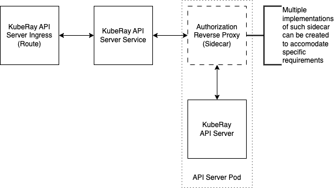

<!-- markdownlint-disable MD013 -->
# Setup APIServer with Security

Currently, the KubeRay APIServer deployed on a publicly accessible cluster is directly exposed to the internet without authentication or authorization. To protect its endpoint, we need to introduce security.
The solution is based on the architecture below:



It essentially adds an Authorization sidecar to the KubeRay APIServer pod. This architecture is highly flexible and allows users to integrate sidecar implementations that meet their specific security requirements, which can vary significantly across organizations.

Here, we will use a very simple [sidecar implementation](../experimental/cmd/main.go) with
a reverse proxy using token-based authorization. This is a basic authorization mechanism
based on a string token shared between the proxy and the client. This implementation is not intended for
production but serves as a demonstration. Additional examples of reverse proxy
implementations can be found [here](https://github.com/blublinsky/auth-reverse-proxy).
There is also a wealth of open-source implementations, for example,
[oauth2-proxy](https://github.com/oauth2-proxy/oauth2-proxy) and many commercial
offerings.

## Basic token-based authentication reverse proxy

A simple token-based authentication reverse proxy [implementation](../experimental/cmd/main.go) is provided in the project, along with make targets to build a Docker image for it and push this image to the image repository. There is also a pre-built image `kuberay/security-proxy:nightly` that you can use for experimenting with security.

## Installation

### Set `security.proxy.tag`

Before installation, please set `security.proxy.tag` to `latest` in
[values.yaml](../helm-chart/kuberay-apiserver/values.yaml) file.

Note that in this `values.yaml` file, there is a security configuration:

```yaml
security:
  proxy:
    repository: kuberay/security-proxy
    tag: nightly
    pullPolicy: IfNotPresent
  env:
    HTTP_LOCAL_PORT: 8988
    GRPC_LOCAL_PORT: 8987
    SECURITY_TOKEN: "12345"
    SECURITY_PREFIX: "/"
    ENABLE_GRPC: "true"
```

Removing this section will run the APIServer without security.

### Deploy KubeRay operator and APIServer with security

Setting up a kind cluster with all required components can be done using the following command:

```sh
make cluster operator-image docker-image security-proxy-image cluster load-operator-image load-image load-security-proxy-image deploy-operator deploy
```

Alternatively, to install only the APIServer with the security configuration, you can use the
following Helm command:

```sh
# Navigate to helm-chart/ directory if haven't
cd helm-chart
helm install apiserver kuberay-apiserver
```

## Example

Once the APIServer is installed, execute the following command:

```sh
curl --silent -X POST 'localhost:31888/apis/v1/namespaces/default/compute_templates' \
    --header 'Content-Type: application/json' \
    --data @docs/api-example/compute_template.json
```

This fails with the result `Unauthorized`. To make it work, we need to add an authorization
header to the request:

```sh
curl --silent -X POST 'localhost:31888/apis/v1/namespaces/default/compute_templates' \
    --header 'Content-Type: application/json' \
    --header 'Authorization: 12345' \
    --data @docs/api-example/compute_template.json
```

### Clean up

```sh
make clean-cluster
# Remove APIServer from Helm
helm uninstall kuberay-apiserver
```
