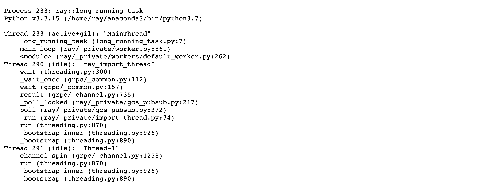

# Profiling with KubeRay

[py-spy](https://github.com/benfred/py-spy/tree/master) is a sampling profiler for Python programs. It lets you visualize what your Python program is spending time on without restarting the program or modifying the code in any way.

This document describes how to configure RayCluster YAML file to enable py-spy and see Stack Trace and CPU Flame Graph via Ray dashboard.

### **Theory**
py-spy requires the `SYS_PTRACE` capability to read process memory. However, Kubernetes omits this capability by default. To enable profiling, add the following to the `template.spec.containers` for both the head and workers.

```bash
securityContext:
  capabilities:
    add:
    - SYS_PTRACE
```

### **Steps to deploy and test the RayCluster with `SYS_PTRACE` capability**

1. **Create a KinD cluster**:
    ```bash
    kind create cluster
    ```

2. **Install the KubeRay operator**:

    Follow the steps in [Installation Guide](https://github.com/ray-project/kuberay/blob/master/helm-chart/kuberay-operator/README.md#install-crds-and-kuberay-operator).


3. **Create a RayCluster with `SYS_PTRACE` capability**:
    ```bash
    # Path: kuberay/ray-operator/config/samples
    kubectl apply -f ray-cluster.profiling.yaml
    ```

4. **Forward the dashboard port**:
    ```bash
    kubectl port-forward --address 0.0.0.0 svc/raycluster-profiling-head-svc 8265:8265
    ```

5. **Run a sample job within the head Pod**:
    ```bash
    # Log in to the head Pod
    kubectl exec -it ${YOUR_HEAD_POD} -- bash

    # (Head Pod) Run a sample job in the Pod
    python3 samples/long_running_task.py
    ```

6. **Profile using the Ray dashboard**:
    - Visit http://localhost:8265/#/cluster.
    - Click `Stack Trace` for `ray::long_running_task`.
      

    - Click `CPU Flame Graph` for `ray::long_running_task`.
      
    - For additional details on using the profiler, refer the [Ray Observability Guide](https://docs.ray.io/en/latest/ray-observability/user-guides/debug-apps/optimize-performance.html#python-cpu-profiling-in-the-dashboard).

7. **Clean up the RayCluster**: 
    ```bash
    kubectl delete -f ray-cluster.profiling.yaml
    ```

### **Note**
- If you see the error `Failed to write flamegraph: I/O error: No stack counts found` when trying to view the CPU Flame Graph, it might be because the process is idle. See this [issue](https://github.com/benfred/py-spy/issues/321#issuecomment-731848950) for further details.

- Adding `SYS_PTRACE` is forbidden under `baseline` and `restricted` Pod Security Standards. See [Pod Security Standards](https://kubernetes.io/docs/concepts/security/pod-security-standards/) for more details.
