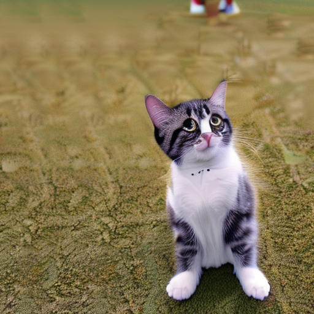

# Serve a StableDiffusion text-to-image model using RayService

> **Note:** The Python files for the Ray Serve application and its client are in the [ray-project/serve_config_examples](https://github.com/ray-project/serve_config_examples) repo 
and [the Ray documentation](https://docs.ray.io/en/latest/serve/tutorials/stable-diffusion.html).

## Step 1: Create a Kubernetes cluster with GPUs

Follow [aws-eks-gpu-cluster.md](./aws-eks-gpu-cluster.md) to create an AWS EKS cluster with 1
CPU (`m5.xlarge`) node and 1 GPU (`g5.xlarge`) node.

## Step 2: Install the nightly KubeRay operator

Follow [this document](../../helm-chart/kuberay-operator/README.md) to install the **nightly** KubeRay operator via 
Helm. We're installing the nightly release here since this example's YAML file uses `serveConfigV2`, which uses features that will be released in KubeRay v0.6.0.

## Step 3: Install a RayService

```sh
# path: ray-operator/config/samples/
kubectl apply -f ray-service.stable-diffusion.yaml
```
This YAML file contains some important settings:
* The `tolerations` for workers must match the taints on the GPU node group. Without the tolerations, worker Pods won't be scheduled on GPU nodes.
    ```yaml
    # Please add the following taints to the GPU node.
    tolerations:
        - key: "ray.io/node-type"
        operator: "Equal"
        value: "worker"
        effect: "NoSchedule"
    ```
* It includes `diffusers` in `runtime_env` since this package is not included by default in the `ray-ml` image.

## Step 4: Forward the port of Serve

```sh
kubectl port-forward svc/stable-diffusion-serve-svc 8000
```

Note that the RayService's Kubernetes service will be created after the Serve applications are ready and running. This process may take approximately 1 minute after all Pods in the RayCluster are running.

## Step 5: Send a request to the text-to-image model

```sh
# Step 5.1: Download `stable_diffusion_req.py` 
curl -LO https://raw.githubusercontent.com/ray-project/serve_config_examples/master/stable_diffusion/stable_diffusion_req.py

# Step 5.2: Set your `prompt` in `stable_diffusion_req.py`.

# Step 5.3: Send a request to the Stable Diffusion model.
python stable_diffusion_req.py
# Check output.png
```

