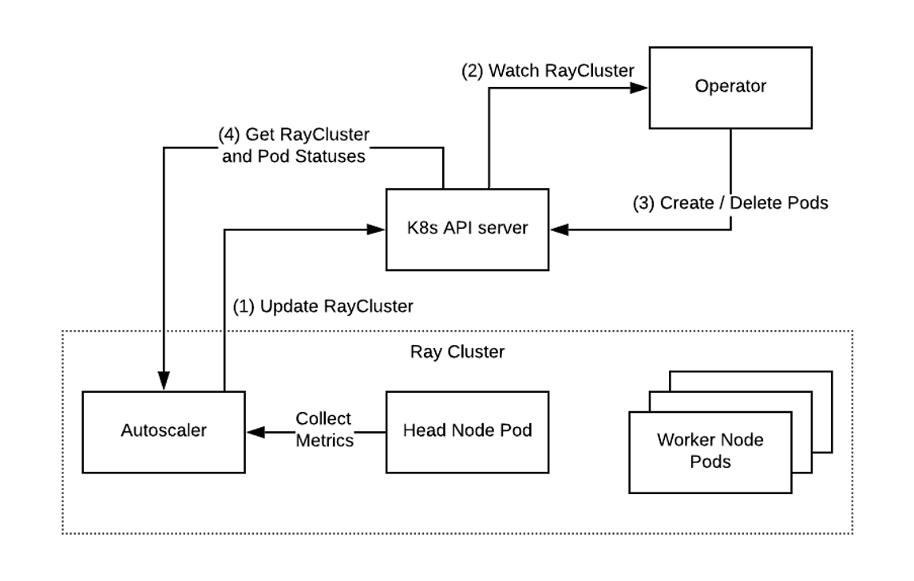

# Ray Kubernetes Operator

The KubeRay Operator makes deploying and managing Ray clusters on top of Kubernetes painless. Clusters are defined as a custom RayCluster resource and managed by a fault-tolerant Ray controller. The KubeRay Operator automates Ray cluster lifecycle management, autoscaling, and other critical functions.



Below are some of the main features of the KubeRay operator:

- Management of first-class RayClusters via a [custom resource](https://kubernetes.io/docs/concepts/extend-kubernetes/api-extension/custom-resources/#custom-resources).
- Support for heterogenous worker types in a single Ray cluster.
- Optional Ray Autoscaler integration; autoscaling based on Ray application semantics.
- Use of Kubernetes `PodTemplates` to configure Ray pods.
- Use of `ScaleStrategy` to remove specific Ray worker pods.
- Automatated management of critical configuration, such as required `environment variables`, the `ray start` entrypoint, and a `dev/shm` volume mount for Ray's shared memory.
- Built-in monitoring via Prometheus.
- Each `RayCluster`'s Status is updated based on the state of running Ray pods.
- Kubernetes Events concerning `RayCluster` instances are emitted to aid observability.

## Overview

When deployed, the KubeRay Operator will watch for K8s events (Create/Delete/Update) for `RayCluster` resources. The KubeRay Operator can create a Ray cluster (Ray head pod + multiple Ray worker pods), delete a Ray cluster, or update the Ray cluster by adding or removing worker pods.

### Ray cluster creation

Once a `RayCluster` resource is created, the operator will configure and create the Ray head pod and the Ray worker pods specified in the `raycluster` manifest as shown below.


### Ray cluster update

You can update the number of replicas in a worker group, and specify which exact replica to remove by updating the RayCluster resource manifest:


!!! note

    While updating `replicas` and `workersToDeleteUpdate` is supported, updating other fields in RayCluster manifests is **not** supported.
    In particular, updating Ray head pod and Ray worker pod configuration is not supported. To update pod configuration,
    delete the RayCluster, edit its configuration and then re-create the cluster. In other words,
    use `kubectl delete` and `kubectl create` to update a RayCluster's pod configuration, rather than `kubectl apply`.
    Support for in-place updates of pod configuration is tracked in KubeRay issue [#527](https://github.com/ray-project/kuberay/issues/527).

### Deploy the operator

```shell
kubectl create -k "github.com/ray-project/kuberay/ray-operator/config/default?ref=v0.6.0&timeout=90s"
```

Check that the controller is running.
```shell
$ kubectl get deployments -n ray-system
NAME           READY   UP-TO-DATE   AVAILABLE   AGE
ray-operator   1/1     1            1           40s

$ kubectl get pods -n ray-system
NAME                            READY   STATUS    RESTARTS   AGE
ray-operator-75dbbf8587-5lrvn   1/1     Running   0          31s
```

Delete the operator.
```shell
kubectl delete -k "github.com/ray-project/kuberay/ray-operator/config/default"
```

### Running an example cluster

We include a few example config files to deploy RayClusters:

Sample  | Description
------------- | -------------
[ray-cluster.mini.yaml](config/samples/ray-cluster.mini.yaml)   | Small example consisting of 1 head pod.
[ray-cluster.heterogeneous.yaml](config/samples/ray-cluster.heterogeneous.yaml)  | Example with heterogenous worker types. 1 head pod and 2 worker pods, each of which has a different resource quota.
[ray-cluster.complete.yaml](config/samples/ray-cluster.complete.yaml)  | Shows all available custom resource properties.
[ray-cluster.autoscaler.yaml](config/samples/ray-cluster.autoscaler.yaml)  | Shows all available custom resource properties and demonstrates autoscaling.
[ray-cluster.complete.large.yaml](config/samples/ray-cluster.complete.large.yaml)  | Demonstrates resource configuration for production use-cases.
[ray-cluster.autoscaler.large.yaml](config/samples/ray-cluster.autoscaler.large.yaml)  | Demonstrates resource configuration for autoscaling Ray clusters in production.

!!! note

    For production use-cases, make sure to allocate sufficient resources for your Ray pods; it usually makes
    sense to run one large Ray pod per Kubernetes node. We do not recommend allocating less than 8Gb memory for a Ray pod
    running in production. Always set limits for memory and CPU. When possible, set requests equal to limits.
    See the [Ray documentation](https://docs.ray.io/en/latest/cluster/kubernetes/user-guides/config.html#resources) for further guidance.
    See [ray-cluster.complete.large.yaml](config/samples/ray-cluster.complete.large.yaml) and
    [ray-cluster.autoscaler.large.yaml](config/samples/ray-cluster.autoscaler.large.yaml) for examples of RayCluster
    resource configurations suitable for production.
    The rest of the sample configs above are meant only for experimentation in local kind or minikube environments.

    The memory usage of the KubeRay Operator depends on the number of pods and Ray clusters being managed.
    Anecdotally, managing 500 Ray pods requires roughly 500MB memory. Monitor memory usage and adjust requests and limits as needed.

We recommend running the following example in a kind or minikube environment with a resource capacity of at least 4CPU and 4Gb memory.
Run the following commands from the root of your cloned kuberay repo.
```shell
# Clone the kuberay repo if you haven't already.
$ git clone https://github.com/ray-project/kuberay
# Enter the root of the repo
$ cd kuberay/
# If you haven't already done so, deploy the KubeRay operator.
$ kubectl create -k ray-operator/config/default
# Create a RayCluster and a ConfigMap with hello world Ray code.
$ kubectl create -f ray-operator/config/samples/ray-cluster.heterogeneous.yaml
configmap/ray-code created
raycluster.ray.io/raycluster-heterogeneous created

# List running clusters.
$ kubectl get rayclusters
NAME                AGE
raycluster-heterogeneous   2m48s

# The created cluster should include a head pod, worker pod, and a head service.
# It may take a few minutes for the pods to enter Running status.
# If you're on minikube or kind, a Pending status indicates that your local Kubernetes environment
# may not have sufficient CPU or memory capacity -- try adjusting your Docker settings.
$ kubectl get pods
NAME                                                 READY   STATUS    RESTARTS   AGE
raycluster-heterogeneous-head-9t28q                  1/1     Running   0          97s
raycluster-heterogeneous-worker-medium-group-l9x9n   1/1     Running   0          97s
raycluster-heterogeneous-worker-small-group-hldxz    1/1     Running   0          97s
raycluster-heterogeneous-worker-small-group-tmgtq    1/1     Running   0          97s
raycluster-heterogeneous-worker-small-group-zc5dh    1/1     Running   0          97s
```

```shell
$ kubectl get services
NAME                                TYPE        CLUSTER-IP     EXTERNAL-IP   PORT(S)                       AGE
kubernetes                          ClusterIP   10.96.0.1      <none>        443/TCP                       22h
raycluster-heterogeneous-head-svc   ClusterIP   10.96.47.129   <none>        6379/TCP,8265/TCP,10001/TCP   2m18s
```

```shell
# Check the logs of the head pod. (Substitute the name of your head pod in this step.)
$ kubectl logs raycluster-heterogeneous-head-9t28q
2022-09-21 13:21:57,505	INFO usage_lib.py:479 -- Usage stats collection is enabled by default without user confirmation because this terminal is detected to be non-interactive. To disable this, add `--disable-usage-stats` to the command that starts the cluster, or run the following command: `ray disable-usage-stats` before starting the cluster. See https://docs.ray.io/en/master/cluster/usage-stats.html for more details.
2022-09-21 13:21:57,505	INFO scripts.py:719 -- Local node IP: 10.244.0.144
2022-09-21 13:22:00,513	SUCC scripts.py:756 -- --------------------
2022-09-21 13:22:00,514	SUCC scripts.py:757 -- Ray runtime started.
2022-09-21 13:22:00,514	SUCC scripts.py:758 -- --------------------
2022-09-21 13:22:00,514	INFO scripts.py:760 -- Next steps
2022-09-21 13:22:00,514	INFO scripts.py:761 -- To connect to this Ray runtime from another node, run
2022-09-21 13:22:00,514	INFO scripts.py:766 --   ray start --address='10.244.0.144:6379'
2022-09-21 13:22:00,514	INFO scripts.py:780 -- Alternatively, use the following Python code:
2022-09-21 13:22:00,514	INFO scripts.py:782 -- import ray
2022-09-21 13:22:00,514	INFO scripts.py:795 -- ray.init(address='auto', _node_ip_address='10.244.0.144')
2022-09-21 13:22:00,515	INFO scripts.py:799 -- To connect to this Ray runtime from outside of the cluster, for example to
2022-09-21 13:22:00,515	INFO scripts.py:803 -- connect to a remote cluster from your laptop directly, use the following
2022-09-21 13:22:00,515	INFO scripts.py:806 -- Python code:
2022-09-21 13:22:00,515	INFO scripts.py:808 -- import ray
2022-09-21 13:22:00,515	INFO scripts.py:814 -- ray.init(address='ray://<head_node_ip_address>:10001')
2022-09-21 13:22:00,515	INFO scripts.py:820 -- If connection fails, check your firewall settings and network configuration.
2022-09-21 13:22:00,515	INFO scripts.py:826 -- To terminate the Ray runtime, run
2022-09-21 13:22:00,515	INFO scripts.py:827 --   ray stop
2022-09-21 13:22:00,515	INFO scripts.py:905 -- --block
2022-09-21 13:22:00,515	INFO scripts.py:907 -- This command will now block forever until terminated by a signal.
2022-09-21 13:22:00,515	INFO scripts.py:910 -- Running subprocesses are monitored and a message will be printed if any of them terminate unexpectedly. Subprocesses exit with SIGTERM will be treated as graceful, thus NOT reported.
```

Now, we can run the hello world Ray code mounted from the config map created above.
```shell
# Substitute the name of your head pod in this step.
$ kubectl exec raycluster-heterogeneous-head-9t28q -- python /opt/sample_code.py
2022-09-21 13:28:41,176	INFO worker.py:1224 -- Using address 127.0.0.1:6379 set in the environment variable RAY_ADDRESS
2022-09-21 13:28:41,176	INFO worker.py:1333 -- Connecting to existing Ray cluster at address: 10.244.0.144:6379...
2022-09-21 13:28:41,183	INFO worker.py:1515 -- Connected to Ray cluster. View the dashboard at http://10.244.0.144:8265
trying to connect to Ray!
now executing some code with Ray!
Ray Nodes:  {'10.244.0.145', '10.244.0.143', '10.244.0.146', '10.244.0.144', '10.244.0.147'}
Execution time =  4.855740308761597
```

The output of the hello world Ray code shows 5 nodes in the Ray cluster.
```
Ray Nodes:  {'10.244.0.145', '10.244.0.143', '10.244.0.146', '10.244.0.144', '10.244.0.147'}
```

```
# Delete the cluster.
$ kubectl delete raycluster raycluster-heterogeneous
```
